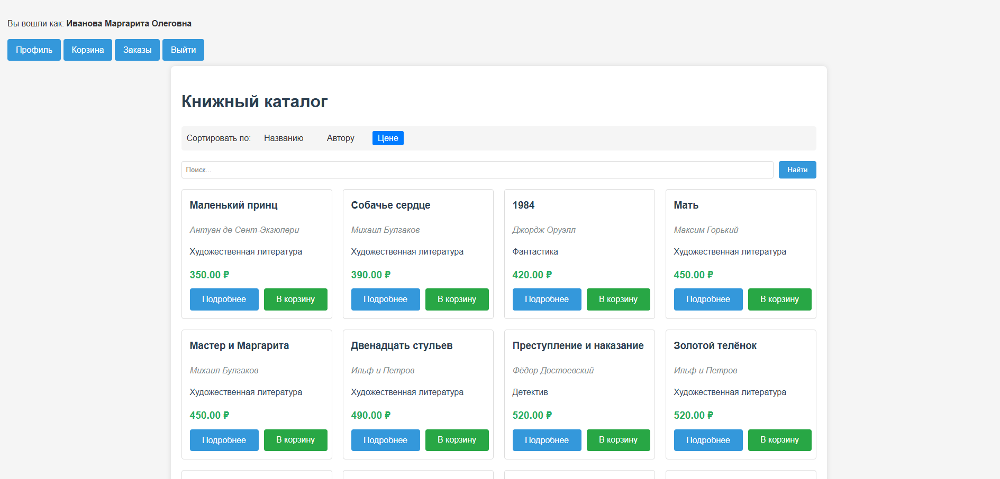
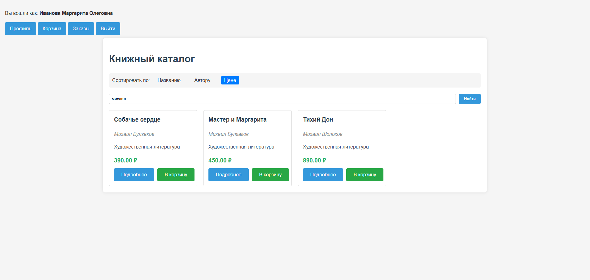
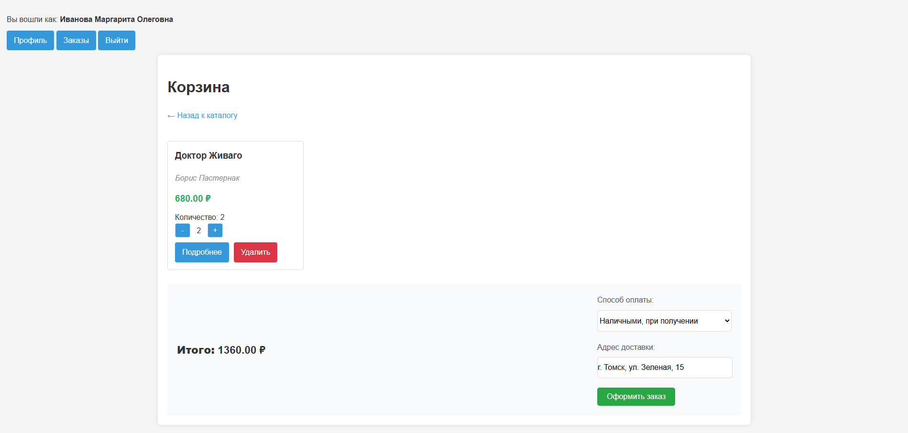
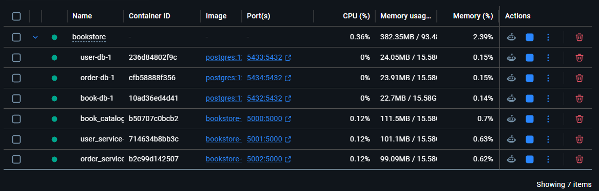

# Микросервисное веб-приложение книжного интернет-магазина

Веб-приложение для продажи книг, построенное на микросервисной архитектуре. Проект состоит из трех независимых сервисов: каталог книг, управление пользователями и обработка заказов.


## Содержание
- [О проекте](#микросервисное-веб-приложение-книжного-интернет-магазина)
- [Скриншоты](#скриншоты)
- [Функциональность](#функциональность)
- [Микросервисы](#микросервисы)
- [Установка и запуск](#установка-и-запуск)
- [Структура проекта](#структура-проекта)

## Скриншоты

<div align="center">
  <table>
    <tr>
      <td align="center">
        
        <br/>
        <b>Каталог книг</b>
      </td>
      <td align="center">
        
        <br/>
        <b>Поиск книги</b>
      </td>
    </tr>
    <tr>
      <td align="center">
        
        <br/>
        <b>Корзина</b>
      </td>
      <td align="center">
        
        <br/>
        <b>Контейнеры docker</b>
      </td>
    </tr>
  </table>
</div>

## Функциональность
* Для всех пользователей
  * Просмотр каталога книг с фильтрацией по жанрам и сортировкой
  * Поиск книг по названию и автору
  * Детальная информация о каждой книге
* Для авторизованных пользователей
  * Регистрация и вход в систему (JWT-аутентификация)
  * Добавление книг в корзину
  * Оформление заказов
  * Просмотр истории заказов и отмена заказов

## Стек технологий
* **Бэкенд:** Flask 3.1.1, Python 3.12
* **База данных:** PostgreSQL
* **Frontend:** HTML, CSS, JavaScript
* **Контейнеризация:** Docker

## Микросервисы
## 1. **book_catalog_service** (Каталог книг)
* Порт: 5000
* Функционал:
    * Хранение и управление каталогом книг
    * Поиск и фильтрация
    * Выдача информации о книгах по API
## 2. **user_service** (Управление пользователями)
* Порт: 5001
* Функционал:
    * Регистрация и авторизация
    * Управление корзиной пользователя
    * Генерация и проверка JWT-токенов
## 3. **order_service** (Обработка заказов)
* Порт: 5002
* Функционал:
  * Создание заказов
  * Просмотр истории заказов
  * Отмена заказов
  * Статусы заказов

Каждый микросервис имеет собственную базу данных и работает независимо. Обмен данными между сервисами происходит через REST API.

## Установка и запуск
1. Клонирование репозитория
```bash
git clone https://github.com/AlexanderSh11/bookstore.git
cd bookstore
```
2. Создание и активация виртуального окружения
```bash
python -m venv .venv
source .venv/bin/activate  # Linux/Mac
.venv\Scripts\activate     # Windows
```
3. Установка зависимостей
```bash
pip install -r book_catalog_service/requirements.txt  
pip install -r user_service/requirements.txt  
pip install -r order_service/requirements.txt  
```
4. Настройка переменных окружения  
Создайте файл .env на основе .env-example
5. Запуск всех сервисов
```bash
docker-compose up -d
```
6. Проверка статуса
```bash
docker-compose ps
```

После запуска сервисы будут доступны:
+ Каталог книг: http://localhost:5000
+ Управление пользователями: http://localhost:5001
+ Обработка заказов: http://localhost:5002

## Структура проекта

bookstore/  
├── book_catalog_service/          # Микросервис каталога книг  
│   ├── app.py                     # Точка входа  
│   ├── models.py                  # Модели БД (Book, Genre)  
│   ├── routes.py                  # Маршруты API  
│   ├── config.py                  # Конфигурация  
│   ├── requirements.txt           # Зависимости  
│   ├── Dockerfile                 # Docker-образ  
│   └── templates/                 # HTML-шаблоны  
│       ├── catalog.html  
│       ├── book_details.html  
│       └── 404.html  
│  
├── user_service/                  # Микросервис пользователей  
│   ├── app.py  
│   ├── models.py                  # Модели (User, Cart)  
│   ├── routes.py  
│   ├── config.py  
│   ├── requirements.txt  
│   ├── Dockerfile  
│   └── templates/  
│       ├── login.html  
│       ├── register.html  
│       ├── profile.html  
│       └── cart.html  
│  
├── order_service/                 # Микросервис заказов  
│   ├── app.py  
│   ├── models.py                  # Модели (Order, OrderStatus, Payment)  
│   ├── routes.py  
│   ├── config.py  
│   ├── requirements.txt  
│   ├── Dockerfile  
│   └── templates/  
│       ├── orders.html  
│       ├── order_details.html  
│       └── 401.html  
│  
├── docker-compose.yml             # Оркестрация контейнеров  
├── .env-example                   # Пример переменных окружения  
└── .gitignore  
